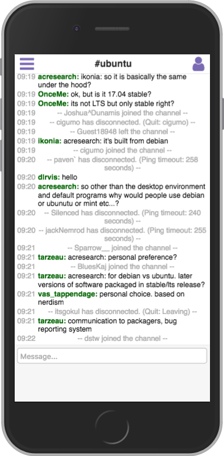
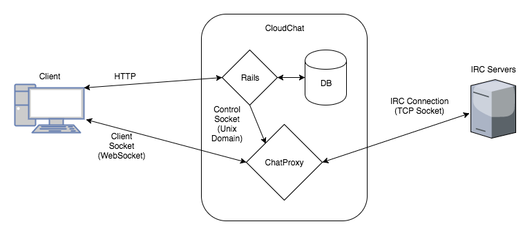

# CloudChat

CloudChat is a web-based IRC (Internet Relay Chat) client.  It's built using React.JS, CSS3, and HTML5 on the front-end and Ruby, Ruby on Rails, and PostgreSQL on the back-end.

CloudChat is not only an IRC webclient, but it also functions as an IRC bouncer.  Meaning, it will act as a proxy for the user and maintain an IRC connection indefinitely, store messages on a server-side buffer which will be replayed when the user reconnects, and can allow multiple client devices access to a single connection.

# End-User Features

## Mobile Mode

Mobile devices are a first-class citizen with CloudChat as CloudChat's UI was designed with a Mobile-First design philosophy.  All features on the desktop version are available on the mobile webapp.
## Simultaneous Multi-Client Capable
CloudChat allows a user to simultaneously connect any number of his or her own devices at once and chat through the same IRC connection.  All devices are kept in synchronization by CloudChat.  So start a conversation on your laptop, then continue it on your phone.  

## Server Side Buffer
CloudChat keeps a record of the last 100 messages in every chat room or private message.  So feel free to close your client. Because when you come back, CloudChat will replay the last 100 lines so you'll always be caught up.

## Multi-server support
Connect to one server or twenty.  CloudChat has you covered.

## Supports Private Messages
Private Messages are treated like their own channel.  It's super easy to get started.

# Technical Highlights

## Web Sockets

CloudChat uses Web Sockets so the web browser can communicate with the CloudChat proxy server. Web Sockets is the perfect technology for this role, as it's natively supported by modern browsers, and there's minimal latency.  Also, web sockets supports encryption which will be implemented in a future version of CloudChat.

## Built using Ruby1459

CloudChat was built on top of Ruby1459, which is an IRC client library I wrote in pure Ruby.  While Ruby1459 and CloudChat were developed simultaneously, Ruby1459 is designed to be used in other projects and is not written with only CloudChat in mind.

## Base64 encoding and JSON

Client to ChatProxy communication is formatted in JSON.

Also, chat messages and other arbitrary user generated strings (quit msgs, etc) are transported over the wire, and stored in buffers, using Base64 encoding.  Base64 encoding avoids any issues with unsupported characters or encoding schemes during the JSON conversion process.

## Multiple reducers for actions

A number of actions dispatched affect multiple reducers.  Such as joining a channel will both create the entry for the channel in the configuration reduce, but will also create a new buffer in the messages reducer.

## Separate proxy process

The heart of CloudChat is the ChatProxy server.  As an IRC connection isn't a stateless request like a HTTP request, using the web server to hold the IRC connection didn't make sense.  So a seperate daemon process was created, called ChatProxy.  It is written in pure ruby and would talk to: 1) the IRC server (through Ruby1459) via a TCPSocket, 2) to Rails through a UNIX Domain Socket, and 3) to the client browser through a WebSocket connection.

ChatProxy creates and maintains all IRC Connections.  It's responsible for maintaining channel buffers and holding the connection state.  And for keeping all connected clients in sync.

This also allows for easy scaling, as multiple ChatProxy instances can be run on multiple servers. Connections can then be spun up on different proxies.

## Mobile first and CSS3

CloudChat makes heavy use of CSS3 to create a comfortable user experience for mobile and desktop users.  Flex boxes, clipping, CSS3 selectors, and media queries are all used for this end.

# Technical Specifications

## Block chart of processes

## connection flow and diagram
1. The user connects via HTTP to rails and authenticates or registers
1. Rails sends ChatProxy the user's info and a server/channel list
1. ChatProxy takes the server list and establishes the IRC connections
1. Rails generates a random token and sends a copy to both ChatProxy and the Client
1. The client establishes a websocket connection to the ChatProxy and uses the token to authenticate
1. The client is now free to communicate over IRC!

_Any new servers/channels are also reported to Rails over HTTP to update the DB_

## control socket command list

The ChatProxy responds to several commands over the Control Socket.

|command|description|
|---|---|
|start|registers a new users with the proxy and starts up any connections if given
|update|pairs a new access token to a user
|kill|stops connections for a given user and deregisters them

## client socket command list

### From Client to ChatProxy:

|command|description|
|---|---|
|join|joins a new channel
|part|leaves a channel|
|speak|sends a message to a channel or private message
|connect|starts a connection to a new server
|disconnect|stops a connection to an irc server

### From ChatProxy to Client:

|command|description|
|---|---|
|welcome_package|the initial state of all connections, channels, and buffers when a client freshly connections
|chanmsg|a new channel message or a new private message
|chan_join|when another user joins a channel
|chan_part|when another user leaves a channel
|chan_self_join|when the User joins a new channel or private message
|chan_self_part|when the User leaves a channel or private message
|add_server|a new server has been connected to and needs to be displayed
|del_server|a server has been disconnected and no longer should be displayed
|new_topic|the topic for a room has changed

# future direction

There's still a tremendous amount of work to be done.  Some major items I plan on adding soon are:

* nickname tab completion
* input buffer
* preset server list
* notification support
* new msg counters for unfocused channels
* SSL support
